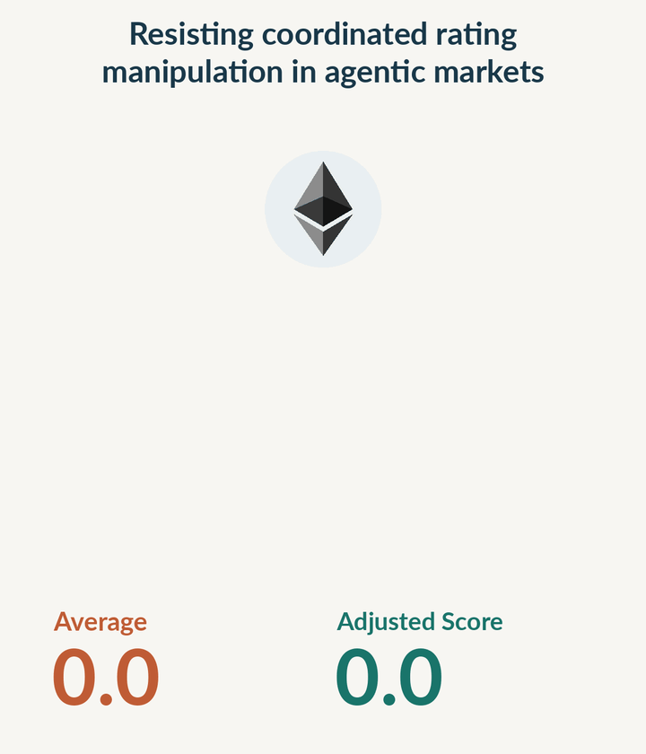

<h1 align="center">Confidence Scoring for ERC-8004 Agents</h1>

<p align="center">
  <a href="https://habibdebaya.github.io/">Habib Debaya</a>
</p>

<p align="center">
  <a href="https://habibdebaya.github.io/agent-confidence/">Live demo</a> ·
  <a href="https://habibdebaya.github.io/agent-confidence/technical-report/">Technical report</a> ·
  <a href="#reproduction">Reproduction</a>
</p>

A high review count can reflect repeated feedback from the same source. This project looks at the evidence behind ERC-8004 agent ratings, groups related reviewers, and accounts for limited independent support.

Explore the demo to search by agent name, ID, or wallet address and see the evidence behind each score.

<p align="center">
  <a href="https://habibdebaya.github.io/agent-confidence/">
    
  </a>
</p>

## How it works

- Keep eligible `starred` ratings from 0 to 100 and exclude groups linked to the agent's owner.
- Use the lowest rating from each observed reviewer group, so repeated positive ratings within that group cannot raise its contribution.
- Add four hypothetical zero-rated sources to the average to account for limited evidence.

Payment matches provide context without changing the score. Hidden reviewer relationships can still inflate scores, and incorrect grouping can lower them. The score measures support from recorded ratings. It does not predict the chance of successful service delivery.

<p align="center">
  
</p>

In this example, 1,000 ratings of 100 added to an existing reviewer group raise the average to 99.9. The adjusted score remains at 16.7. The [technical report](docs/technical-report.md) explains the calculation and examines where the method fails.

The demo uses a Base snapshot from 3 September 2026 with 84,376 agents and 461,035 active feedback records. Of those agents, 226 receive a nonzero score and five score at least 50.

## Try it locally

Python 3 is enough to build and serve the demo. The data is included.

```bash
make site
python3 -m http.server 8000 --directory dist
```

Open [localhost:8000](http://localhost:8000/).

## Reproduction

With Python 3.11 or later:

```bash
make install
make confidence-check
make test
```

These commands install dependencies, rebuild every published score from the included evidence, and run the tests. No RPC credentials are needed. See the [data guide](docs/data.md) for collection and reconstruction details.

Built around [ERC-8004](https://eips.ethereum.org/EIPS/eip-8004), with research context from [Can Trustless Agents Be Trusted?](https://arxiv.org/abs/2606.26028).
