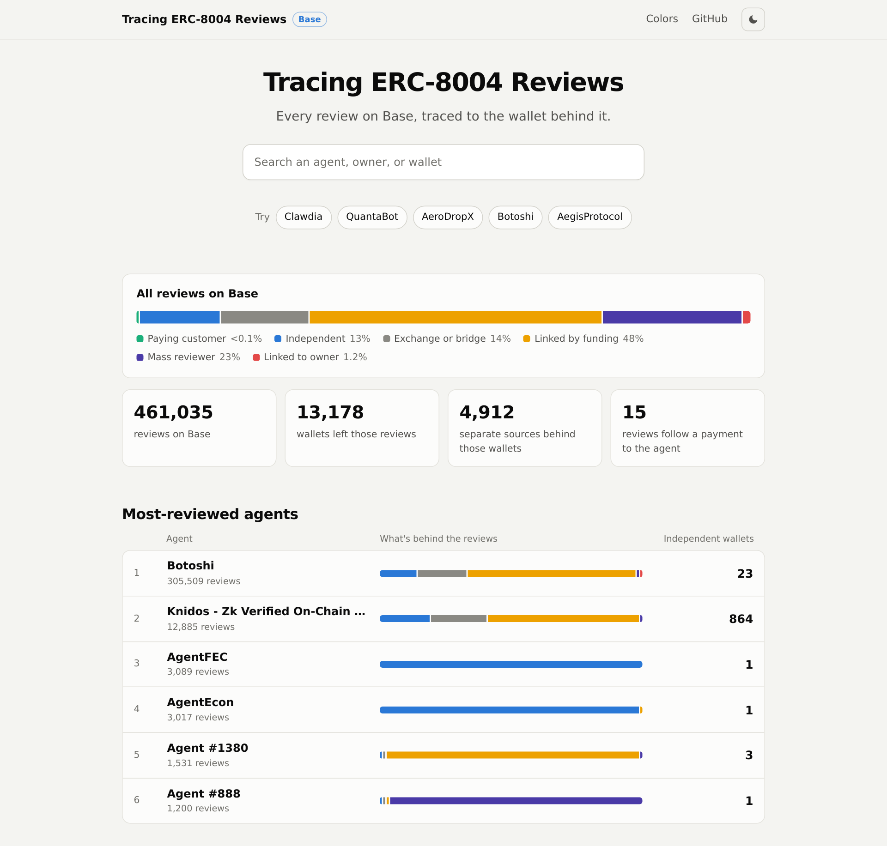

<h1 align="center">Tracing ERC-8004 Reviews</h1>

<p align="center">
  <a href="https://habibdebaya.github.io/">Habib Debaya</a>
</p>

<p align="center">
  <a href="https://habibdebaya.github.io/agent-confidence/">Live site</a> ·
  <a href="#run-it-locally">Run it locally</a> ·
  <a href="#data">Data</a>
</p>

Every ERC-8004 review on Base, traced to the wallet that left it and to where that wallet first got its money. Search any agent to see how many separate sources stand behind its reviews, with the transaction behind each one.

<p align="center">
  <a href="https://habibdebaya.github.io/agent-confidence/">
    
  </a>
</p>

## What it shows

Review counts on ERC-8004 are easy to inflate. Most of the 461,035 reviews on Base come from a wallet that had already reviewed the same agent, and the 13,178 wallets behind them come down to 4,912 separate sources. The site sorts every review into one of six groups.

- **Paying customer** paid the agent before reviewing it
- **Independent** was funded by a wallet with no tie to any other reviewer
- **Exchange or bridge** was first funded through an exchange, a bridge or a similar service, so funding cannot show who is behind it
- **Linked by funding** got its first funds from the same place as other reviewers
- **Mass reviewer** belongs to a source that reviewed 100 or more agents
- **Linked to owner** is funded by or connected to the owner of the agent it reviewed

Each agent also shows its independent wallets, which counts the wallets in the first two groups once each, however many reviews they left.

## How wallets are linked

Reviewer wallets join one source when one wallet gave them their first funds, when one funded another, when they are tied through agent ownership, or when they send USDC around a closed loop within 30 days. Exchanges and bridges never link wallets by funding alone. Wallets funded by the same exchange or bridge within one minute are linked only when they also reviewed the same agent. Known services are listed with their Basescan name tags in [data/funders.csv](data/funders.csv).

A link records a shared money trail and nothing more. About 40% of reviewer wallets were first funded through an exchange, a bridge or a similar service, and for those the trail stops.

## Run it locally

Python 3 is enough to build and serve the site. The data is included.

```bash
make site
python3 -m http.server 8000 --directory dist
```

Then [open the site](http://localhost:8000/) in your browser.

## Reproduce

With Python 3.11 or later

```bash
make install
make check
make test
```

`make check` rebuilds every label and total from the published files and verifies their fingerprints, with no RPC access needed.

## Data

The snapshot is Base block 50,815,929, taken on 3 September 2026.

| File | Contents |
|---|---|
| `app/static/data/meta.json` | Snapshot details, totals, most-reviewed agents, mass reviewers, payment matches and file fingerprints |
| `app/static/data/agents.json` | Every registered agent with its owner, declared wallets and reviews per group |
| `app/static/data/reviewers.json` | Every reviewer wallet with its source, first funder, funding transaction, link reason and the agents it reviewed |
| `app/static/data/feedback/*.json` | Reviews for each agent, split by agent ID. Each wallet keeps its latest 50 reviews next to exact totals |

Rebuilding the snapshot from the chain needs RPC access set in `.env` (see `.env.example`) and runs the crawler, then the build.

```bash
.venv/bin/erc8004 crawl --chain base --end-block 50815929
.venv/bin/erc8004 offchain --chain base
.venv/bin/erc8004 provenance --chain base --end-block 50815929
.venv/bin/erc8004 infrastructure --chain base --end-block 50815929
.venv/bin/erc8004 payments --chain base --end-block 50815929
make grounding
make data
```

Built on [ERC-8004](https://eips.ethereum.org/EIPS/eip-8004), with research context from [Can Trustless Agents Be Trusted?](https://arxiv.org/abs/2606.26028)
